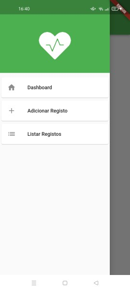

# Mini Projeto Flutter - CM

## Falta
1. Dashboard - funções feitas falta chamar no dashboard e gráfico
2. Testes Unitarios

## Feito por: Pedro Costa - a21904825

### Autoavaliação: 12

### Funcionalidades:

  

### Screenshots:
##### Nota: Fotos retiradas em diferentes dias, data do registo no listar pode ser diferente do visualizar, por essa razão, não problema da app em si.

#### Menu Drawer:

  

#### Dashboard:

  

#### Adicionar Registo:

  

#### Adicionar Registo - Campos Vazios:

  

#### Adicionar Registo - Pop Up:

  

#### Listar Registos:

  

#### Listar Registos - Eliminar com Sucesso:

  
  

#### Listar Registos - Eliminar sem Sucesso:
##### Nota: Foi forçado o erro mudando a condição para o contrário.

#### Visualizar Registo:

#### Visualizar Registo - Não Pode Editar:
##### Nota: Foi forçado o erro mudando a condição para o contrário.

#### Editar Registo:

