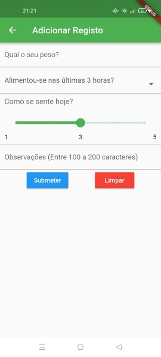
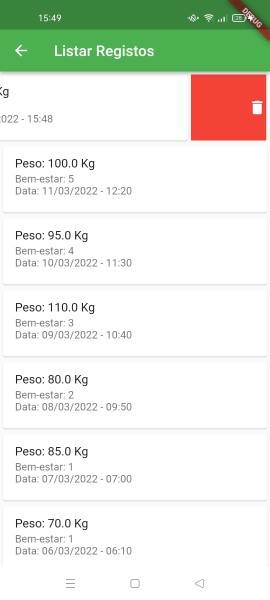
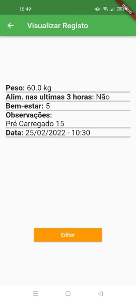
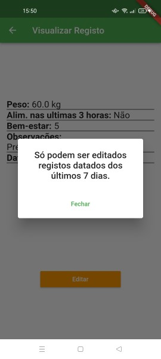
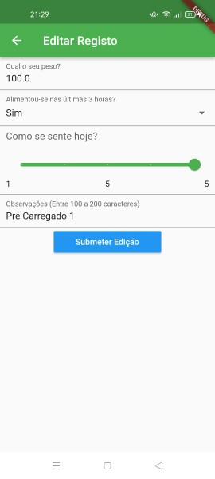
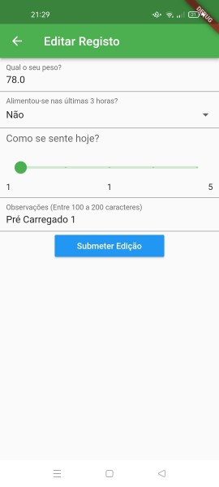

# Mini Projeto Flutter - CM

## Falta Fazer
1. Testes Unitarios

## Feito por: Pedro Costa - a21904825

### Autoavaliação: 17

### Funcionalidades:

  

### Screenshots:

#### Dashboard:

  
  

#### Menu Drawer:

  

#### Adicionar Registo:

  

#### Adicionar Registo - Campos Vazios:

  

#### Adicionar Registo - Pop Up:

  

#### Listar Registos:

  

#### Listar Registos - Eliminar com Sucesso:

  
  

#### Listar Registos - Eliminar sem Sucesso:

  

#### Visualizar Registo:

  

#### Visualizar Registo - Não Pode Editar:

  

#### Editar Registo:
##### 1 - Registo Original
##### 2 - Registo Modificado
##### 3 - Mensagem de Sucesso
##### 4 - Verificado que foi modificado

  
  

  
  

